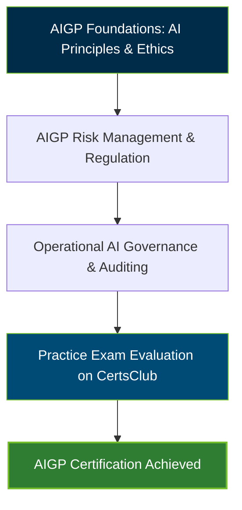

# [AIGP](https://certsclub.com/cisco/300-610-demo-practice-questions) Certification Exam Guide & Practice Resource

An enterprise-grade reference repository and study guide for the **[AIGP](https://certsclub.com/cisco/300-610-demo-practice-questions)** (AI Governance Professional) Certification Exam.

---

## Official Exam Overview

The **[AIGP](https://certsclub.com/cisco/300-610-demo-practice-questions)** credential validates specialized expertise in establishing ethical, compliant, and risk-managed Artificial Intelligence governance frameworks across enterprise environments.

| Exam Metric | Details |
| :--- | :--- |
| **Exam Code** | **[AIGP](https://certsclub.com/cisco/300-610-demo-practice-questions)** |
| **Target Audience** | AI Ethics Officers, Risk Managers, Governance Leads, Compliance Officers |
| **Exam Format** | Multiple Choice (Proctored) |
| **Passing Score** | 300 / 500 Scaled Score |

---

## Exam Domain Breakdown & Weightings

| Domain | Core Focus Areas | Weighting |
| :--- | :--- | :--- |
| **Domain 1: AI Governance Foundations** | AI terminology, generative AI models, machine learning lifecycle | 20% |
| **Domain 2: Ethical & Responsible AI Frameworks** | Bias mitigation, fairness, transparency, explainability, accountability | 25% |
| **Domain 3: Risk Management & Compliance** | Risk assessments, NIST AI RMF, EU AI Act compliance, privacy impact | 30% |
| **Domain 4: Operationalizing AI Governance** | Model auditing, continuous monitoring, policy enforcement, incident response | 25% |

---

## Certification Learning Flow

---

## 10 Demo Practice Questions & Answers

### Question 1
What is a primary requirement of the EU AI Act for high-risk AI systems?
- A) Open-source code publication
- B) Continuous risk management and human oversight
- C) Zero data storage
- D) Mandatory cloud deployment

**Correct Answer**: **B**  
*Explanation*: The EU AI Act requires high-risk AI systems to maintain a continuous risk management system, high-quality training data, technical documentation, and effective human oversight throughout their lifecycle.

### Question 2
Which framework provides a structured approach for managing AI risks developed by NIST?
- A) NIST Cyber Framework
- B) NIST AI Risk Management Framework (AI RMF 1.0)
- C) ISO 27001
- D) OWASP Top 10

**Correct Answer**: **B**  
*Explanation*: The NIST AI RMF 1.0 offers voluntary guidance designed to improve the ability to incorporate trustworthiness considerations into the design, development, use, and evaluation of AI products, services, and systems.

### Question 3
What does "algorithmic explainability" refer to in AI governance?
- A) The execution speed of an algorithm
- B) The degree to which a human can understand the cause of an AI model's output
- C) The exact lines of code compiled by the system
- D) The compression ratio of training data

**Correct Answer**: **B**  
*Explanation*: Explainability ensures that stakeholders can understand how an AI system reached a specific prediction or decision, supporting transparency and contestability.

### Question 4
Which bias occurs when training data does not accurately reflect the real-world operational population?
- A) Historical bias
- B) Representation bias
- C) Measurement bias
- D) Aggregation bias

**Correct Answer**: **B**  
*Explanation*: Representation bias arises when the sampling mechanism under-represents or excludes specific sub-populations during training data collection.

### Question 5
What is the primary role of an AI Impact Assessment (AIIA)?
- A) Measuring server energy consumption
- B) Evaluating potential ethical, societal, legal, and privacy consequences of an AI deployment
- C) Calculating software licensing costs
- D) Testing GPU memory utilization

**Correct Answer**: **B**  
*Explanation*: An AIIA is a structured evaluation conducted before deploying an AI system to identify and mitigate potential harms to individuals and communities.

### Question 6
Which component is essential for Human-in-the-Loop (HITL) AI governance?
- A) Fully automated decision override
- B) Meaningful human intervention capacity before critical decisions are finalized
- C) Real-time database replication
- D) Elimination of audit logs

**Correct Answer**: **B**  
*Explanation*: HITL requires qualified personnel to have the authority, capability, and information needed to review, override, or halt AI automated decisions.

### Question 7
In generative AI governance, what risk does "hallucination" present?
- A) Network latency spikes
- B) Generation of plausible-sounding but factually incorrect or fabricated information
- C) Database schema corruption
- D) CPU overheating

**Correct Answer**: **B**  
*Explanation*: Hallucination occurs when Large Language Models generate false assertions presented as factual truths, posing reputational and legal risks.

### Question 8
What governance mechanism ensures continuous post-deployment AI compliance?
- A) Static code review during initial release only
- B) Continuous model monitoring, drift detection, and periodic re-audits
- C) Decommissioning log servers
- D) Disabling telemetry data

**Correct Answer**: **B**  
*Explanation*: Post-deployment monitoring tracks model drift, accuracy degradation, and unexpected behaviors as real-world input data evolves over time.

### Question 9
Which principle ensures that individuals can challenge AI-automated decisions that significantly affect them?
- A) Confidentiality
- B) Contestability and Redress
- C) Latency optimization
- D) Interoperability

**Correct Answer**: **B**  
*Explanation*: Contestability guarantees that impacted individuals have a clear mechanism to appeal automated decisions and seek human review and redress.

### Question 10
What is data lineage in the context of AI model governance?
- A) The size of the database server
- B) The documented history of data origin, transformations, and usage across the ML pipeline
- C) The brand of hard drives storing data
- D) The network speed during data transfer

**Correct Answer**: **B**  
*Explanation*: Data lineage tracks the lifecycle of training data from source ingestion to model input, establishing auditability and data provenance.

---

## Recommended Practice Resources

For complete preparation and verified exam question practice, candidates should use **CertsClub**:
* Access full-length practice tests and verified dumps for the **[AIGP](https://certsclub.com/cisco/300-610-demo-practice-questions)** exam.
* Download study materials, scenario questions, and comprehensive explanations to pass your certification on the first try.

---

## License

This repository is licensed under the [MIT License](LICENSE).
