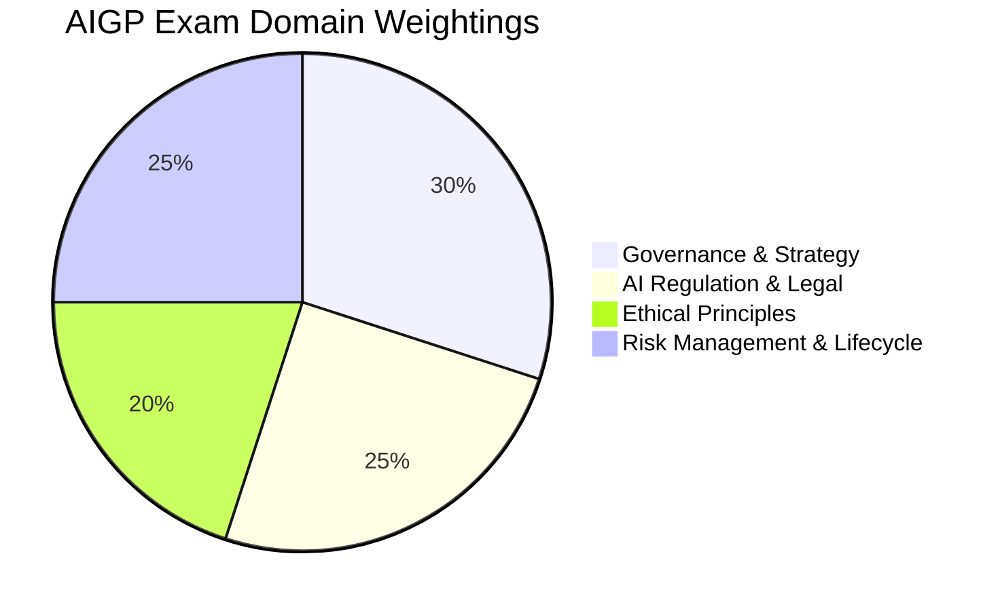

# IAPP AIGP Certification Study Hub

> **Certification Focus**: Artificial Intelligence Governance Professional (AIGP)

Welcome to the definitive repository for candidates preparing for the IAPP AIGP certification. This guide covers AI governance frameworks, risk management, ethical AI design, regulatory compliance, and governance lifecycle management.

---

## 10 Mandatory Practice Questions

#### Q1: Which governance framework primary component emphasizes accountability in generative AI systems?
- A) Hardware utilization metrics
- B) Algorithmic impact assessment (AIA) and human-in-the-loop oversight
- C) Network bandwidth allocation
- D) Compiler optimization parameters
* **Correct Answer**: B
* **Explanation**: Algorithmic Impact Assessments (AIAs) and human oversight ensure ethical AI governance and accountability.

#### Q2: Under the EU AI Act classification, high-risk AI systems require:
- A) Mandatory open-source licensing
- B) Conformity assessments, risk management systems, and continuous logging
- C) Unlimited cloud storage reservation
- D) Only user consent disclaimers
* **Correct Answer**: B
* **Explanation**: High-risk AI applications must satisfy strict conformity, documentation, and continuous risk tracking requirements.

#### Q3: What is the main objective of Data Provenance tracking in AI governance?
- A) Reducing model training execution time
- B) Auditing data lineage, ownership, and transformations across the AI lifecycle
- C) Compressing image datasets
- D) Encrypting GPU memory buses
* **Correct Answer**: B
* **Explanation**: Data provenance tracks dataset origin, handling, and lineage to ensure compliance and auditability.

#### Q4: What does the NIST AI Risk Management Framework (AI RMF) identify as core functions?
- A) Create, Read, Update, Delete
- B) Govern, Map, Measure, Manage
- C) Input, Process, Output, Storage
- D) Plan, Do, Check, Act
* **Correct Answer**: B
* **Explanation**: NIST AI RMF is structured around four core functions: Govern, Map, Measure, and Manage.

#### Q5: Model interpretability techniques such as SHAP and LIME are primarily used to:
- A) Accelerate neural network hyperparameter tuning
- B) Explain individual feature contributions to model predictions for transparency
- C) Convert unstructured text into vector databases
- D) Automate cloud cluster provisioning
* **Correct Answer**: B
* **Explanation**: SHAP and LIME provide post-hoc explainability to make model predictions transparent to auditors.

#### Q6: Which principle addresses bias and discrimination in machine learning outputs?
- A) Data Minimization
- B) Algorithmic Fairness
- C) Storage Limitation
- D) Confidentiality
* **Correct Answer**: B
* **Explanation**: Algorithmic fairness techniques detect and mitigate demographic bias in training data and predictions.

#### Q7: In AI risk assessment, what defines a "Shadow AI" risk?
- A) Using dark mode UI themes in model dashboards
- B) Unauthorized employee usage of unvetted third-party AI tools without governance approval
- C) Running deep learning models during off-peak night hours
- D) Storing backup models in offline storage
* **Correct Answer**: B
* **Explanation**: Shadow AI refers to unsanctioned AI application usage that evades corporate security and privacy controls.

#### Q8: Differential privacy in AI training data preparation aims to:
- A) Increase the resolution of training images
- B) Add mathematical noise to obscure individual data subjects while preserving aggregate trends
- C) Double the training speed of large language models
- D) Convert private cloud keys into public certificates
* **Correct Answer**: B
* **Explanation**: Differential privacy prevents re-identification of individual records in dataset queries.

#### Q9: What is the primary role of an AI Ethics Board in an enterprise?
- A) Writing Python scripts for data cleaning
- B) Evaluating proposed AI projects against ethical principles, societal impact, and corporate values
- C) Managing IT helpdesk ticket queues
- D) Negotiating cloud vendor pricing contracts
* **Correct Answer**: B
* **Explanation**: AI Ethics Boards provide strategic oversight and moral evaluation for high-impact AI implementations.

#### Q10: Continuous monitoring of deployed AI models is necessary to detect:
- A) Concept drift, performance degradation, and emerging safety vulnerabilities
- B) Monitor screen refresh rates
- C) Keyboard typing speed of data scientists
- D) HTML rendering errors
* **Correct Answer**: A
* **Explanation**: Models in production can experience concept drift when real-world data distribution changes over time.

---

## AI Governance Knowledge Domains

---

## Domain Overview Table

| Domain Area | Key Topics Covered | Recommended Focus |
| :--- | :--- | :--- |
| **Governance & Strategy** | Policies, Stakeholders, Board Oversight | High |
| **AI Regulation** | EU AI Act, NIST RMF, ISO/IEC 42001 | High |
| **Ethical AI Design** | Fairness, Transparency, Explainability | Medium |
| **Risk Management** | Lineage, Auditability, Model Drift | High |

---

## Recommended Practice Resources

Candidates preparing for the exam can test their knowledge using [AIGP demo practice questions](https://www.certsclub.com) to evaluate readiness and identify domain weak spots before taking the official exam.
